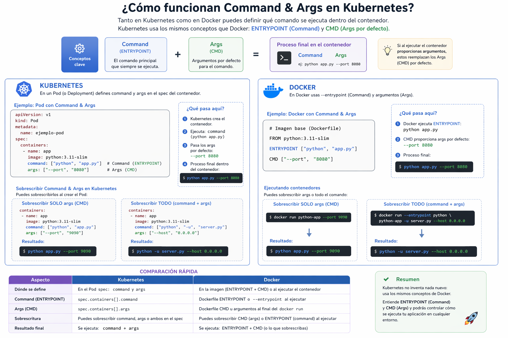

# Command & Args

En Kubernetes, los campos command y args se usan dentro del YAML de un Pod para controlar exactamente qué ejecuta el contenedor cuando inicia.

Estos permiten cambiar comportamiento por defecto de la imagen del container.

A continuacion se muestra la correspondencia entre los comandos en un entorno de ejecucion de contenedores y kubernetes

| Container  |  Kubernetes |
|---|---|
| ENTRYPOINT  | command  |
| CMD  | args  |

- Definicion en yaml
```yml
containers:
  - name: worker
    image: python:3.11
    command: ["python"]
    args: ["worker.py", "--env=prod"]
```

- Equivalencia

```bash
python worker.py --env=prod
```

## Ejemplo

```yml
apiVersion: v1
kind: Pod
metadata:
  name: demo-command
spec:
  containers:
    - name: demo
      image: busybox
      command: ["sh", "-c"]
      args: ["echo Hola Kubernetes && sleep 3600"]
```

<p align="center">

</p>
