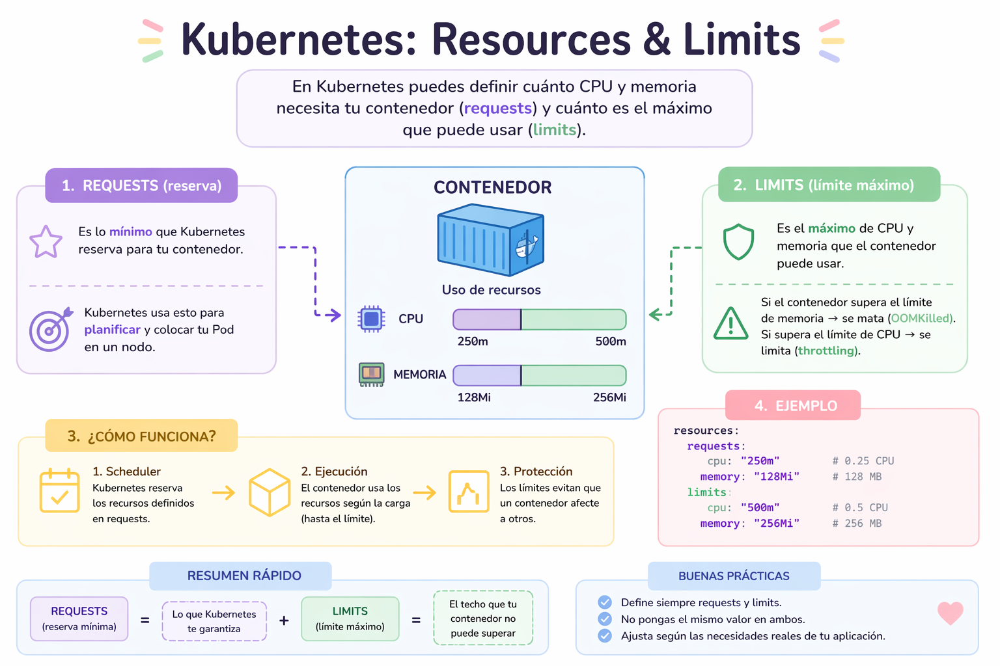

# Resource & Limits

En Kubernetes, los resources (requests y limits) en un Pod sirven para controlar cuánto CPU y memoria usa cada contenedor y cómo el scheduler decide dónde ejecutarlo.

Ejemplo: Dentro de un contenedor en un pod puedes definir:

```yaml
resources:
  requests:
    cpu: "500m"
    memory: "256Mi"
  limits:
    cpu: "1"
    memory: "512Mi"
```

Esto tiene dos partes importantes:

**requests → lo que el pod necesita**
- Es lo mínimo garantizado
- Kubernetes usa esto para decidir en qué nodo colocar el pod (scheduler)
- El nodo debe tener al menos esos recursos disponibles

**limits → lo máximo permitido**
- Define el tope que el contenedor puede usar.

<p align="center">

</p>

## Ejemplo

```yaml
apiVersion: v1
kind: Pod
metadata:
  name: pod-resources-demo
spec:
  containers:
    - name: app
      image: nginx
      resources:
        requests:
          memory: "128Mi"
          cpu: "250m"
        limits:
          memory: "256Mi"
          cpu: "500m"
```
