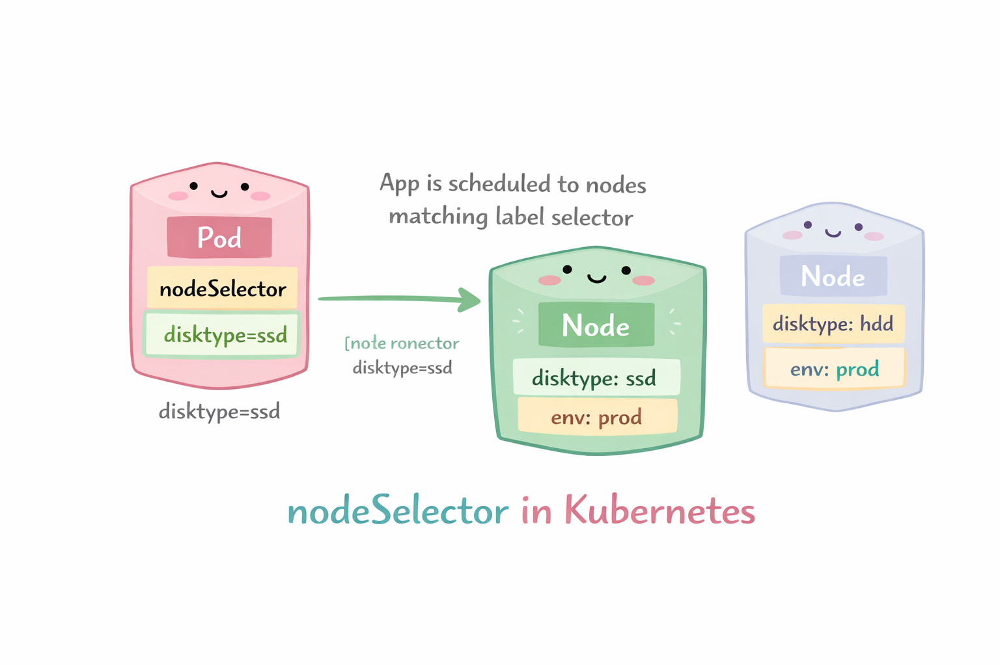

# NodeName & NodeSelector

## NodeName

Puedes especificar el nodeName en el spec del pod. Esto hara que el pod se coloque en el nodo con ese nombre.

<p align="center">

</p>

```yaml
apiVersion: v1
kind: Pod
metadata:
  name: pod-en-nodo-especifico
spec:
  nodeName: node1   # Nombre exacto del nodo
  containers:
  - name: nginx
    image: nginx:latest
    ports:
    - containerPort: 80
```
## NodeSelector

Puedes especificar el nodeSelector en el spec del pod. Esto hara que el pod se coloque en cualquier nodo con esa etiqueta.

<p align="center">

</p>

```yaml
apiVersion: v1
kind: Pod
metadata:
  name: pod-con-nodeselector
spec:
  nodeSelector:
    disktype: ssd   # Etiqueta del nodo
  containers:
  - name: nginx
    image: nginx:latest
    ports:
    - containerPort: 80
```
