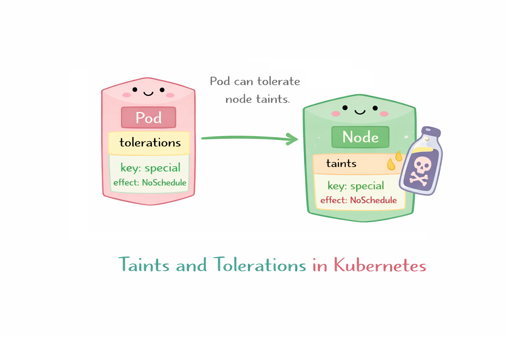

# Taints y tolerations

Los taints y tolerations en Kubernetes son un mecanismo para controlar qué Pods NO pueden ejecutarse en ciertos nodos, a menos que explícitamente lo permitan.

A diferencia de nodeSelector (que atrae Pods), esto funciona como un filtro de exclusión.

- Taint (en el nodo) -> NO quiero Pods aquí
- Toleration (en el Pod) -> yo sí puedo entrar

<p align="center">

</p>

Ejemplo:

kubectl taint nodes nodo1 key=value:NoSchedule

- key=value → etiqueta del taint
- effect → comportamiento

```yaml
apiVersion: v1
kind: Pod
metadata:
  name: pod-con-toleration
spec:
  tolerations:
  - key: "workload"
    operator: "Equal"
    value: "batch"
    effect: "NoSchedule"
  containers:
  - name: nginx
    image: nginx:latest
```

## Tipos de efectos

- NoSchedule: No se programan nuevos Pods (los existentes siguen)
- NoExecute: Expulsa Pods que no toleren el taint
- PreferNoSchedule: Kubernetes intenta evitar ese nodo (no obligatorio)

Ejemplo real:

kubectl taint nodes nodo1 workload=ml:NoSchedule

```yaml
tolerations:
- key: "workload"
  value: "ml"
  effect: "NoSchedule"
```

Resultado:
- Pods normales ❌
- Pods ML ✅
