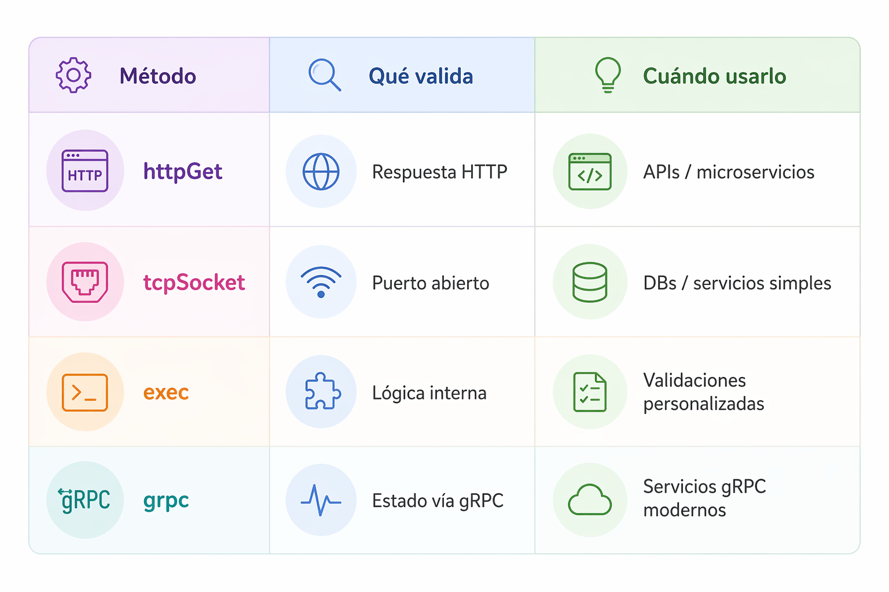

# Liveness, Readiness, and Startup Probes

Kubernetes permite definir probes (sondeos) para monitorizar continuamente el estado de los contenedores en un Pod. Un sondeo es un diagnóstico que el kubelet realiza periódicamente en un contenedor. Para realizar un diagnóstico, el kubelet ejecuta código dentro del contenedor o realiza una solicitud de red.

Según los resultados del probe, Kubernetes puede reiniciar los contenedores con problemas o dejar de enviar tráfico a los contenedores que no están listos.

### Startup Probe

- Verifica si el contenedor termino de arrancar.
- Cuando sea exitoso → Activa el liveness Probe, Activa el readiness Probe.

### Readiness Probe

- Verifica si el contenedor está listo para recibir tráfico.
- Si falla → el Pod deja de recibir tráfico, pero NO se reinicia.

### Liveness Probe

- Verifica si el contenedor sigue vivo.
- Si falla → Kubernetes reinicia el contenedor.

## Ejemplo

En el siguiente pod vemos la implementacion de los probes

```yaml
apiVersion: v1
kind: Pod
metadata:
  name: app-probes-demo
  labels:
    app: app-probes-demo
spec:
  containers:
    - name: app
      image: nginx:1.27
      ports:
        - containerPort: 80

      startupProbe:
        httpGet:
          path: /
          port: 80
        initialDelaySeconds: 5
        periodSeconds: 5
        timeoutSeconds: 2
        failureThreshold: 12

      readinessProbe:
        httpGet:
          path: /
          port: 80
        initialDelaySeconds: 3
        periodSeconds: 5
        timeoutSeconds: 2
        successThreshold: 1
        failureThreshold: 2

      livenessProbe:
        httpGet:
          path: /
          port: 80
        initialDelaySeconds: 10
        periodSeconds: 10
        timeoutSeconds: 2
        failureThreshold: 3
```

### startupProbe

```yaml
  startupProbe:
  httpGet:
    path: /
    port: 80
  initialDelaySeconds: 5
  periodSeconds: 5
  timeoutSeconds: 2
  failureThreshold: 12
```

Esta probe sirve para verificar si la aplicación ya terminó de arrancar.

Mientras startupProbe siga fallando:

- Kubernetes entiende que la app todavía está iniciando.
- No activa todavía la livenessProbe.
- No activa todavía la readinessProbe.

En este ejemplo:

- espera 5 segundos antes del primer chequeo
- prueba cada 5 segundos
- espera máximo 2 segundos por respuesta
- permite hasta 12 fallos

Eso significa que la app puede tardar hasta: 12 × 5 = 60 segundos. Si no logra ser exitoso, Kubernetes reinicia el contenedor.

### readinessProbe

```yaml
readinessProbe:
  httpGet:
    path: /
    port: 80
  initialDelaySeconds: 3
  periodSeconds: 5
  timeoutSeconds: 2
  successThreshold: 1
  failureThreshold: 2
```

Esta probe sirve para verificar si la aplicación está lista para recibir tráfico.

Si readinessProbe falla:

- el contenedor no se reinicia
- el Pod simplemente se marca como NotReady
- Kubernetes deja de enviarle tráfico desde un Service

En este ejemplo

- espera 3 segundos antes de empezar
- revisa cada 5 segundos
- si tarda más de 2 segundos, cuenta como fallo
- con failureThreshold: 2, necesita fallar 2 veces para marcarlo como NotReady

Si el pod es marcado como NotReady, Kubernetes no reinicia el pod, solo deja de mandarle tráfico.

### livenessProbe

```yaml
livenessProbe:
  httpGet:
    path: /
    port: 80
  initialDelaySeconds: 10
  periodSeconds: 10
  timeoutSeconds: 2
  failureThreshold: 3
```

Esta probe sirve para verificar si la aplicación sigue viva.

Si livenessProbe falla varias veces:

- Kubernetes asume que la app quedó colgada o en mal estado
- entonces reinicia el contenedor

En este ejemplo

- espera 10 segundos antes de empezar
- revisa cada 10 segundos
- espera hasta 2 segundos por respuesta
- si falla 3 veces seguidas, reinicia el contenedor

### Resumen simple

- startupProbe: “¿La app ya logró arrancar?”
- readinessProbe: “¿La app está lista para recibir requests?”
- livenessProbe: “¿La app sigue viva o está colgada?”

### Recomendación

Los endpoints tipicos son:

- /startup
- /ready
- /healthz

## Metodos para los Probe

### 1. httpGet

```yaml
readinessProbe:
  httpGet:
    path: /ready
    port: 8080
```
Útil cuando:

- Tu app expone endpoints tipo /health, /ready
- APIs REST
- microservicios web

### 2. tcpSocket

```yaml
livenessProbe:
  tcpSocket:
    port: 5432
```

Útil cuando:

- No tienes endpoint HTTP
- Bases de datos (PostgreSQL, MySQL)
- Servicios que solo abren sockets

Limitación:

- Solo verifica conexión, no estado interno

### 3. exec

```yaml
livenessProbe:
  exec:
    command:
      - sh
      - -c
      - "pg_isready -U postgres"
```

Útil cuando:

- Necesitas lógica personalizada
- Validar archivos, procesos o scripts
- Apps legacy sin HTTP

### 4. grpc

```yaml
livenessProbe:
  grpc:
    port: 50051
```

Útil cuando:

- Tu app usa gRPC
- Implementas el protocolo de health check de gRPC

Requiere:

- Implementar el servicio de salud (grpc.health.v1.Health)


<p align="center">

</p>
