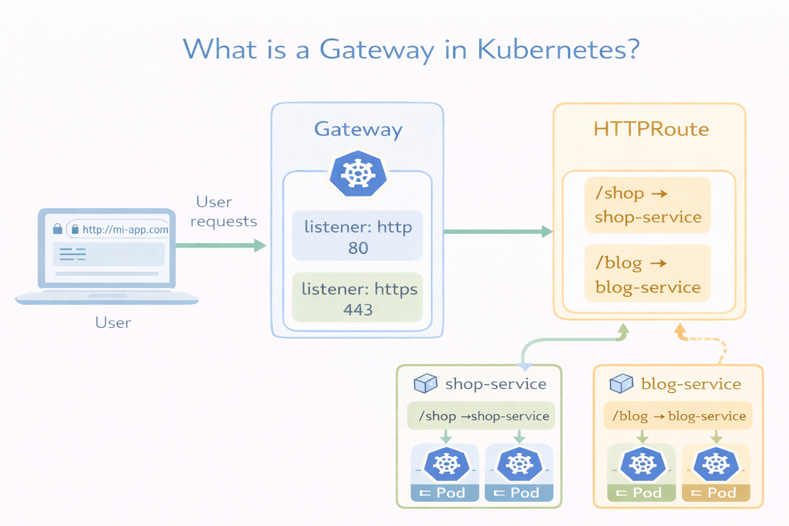

# Gateway API

La API de Kubernetes Gateway es la sucesora de la API de Ingress, diseñada para proporcionar un enfoque más expresivo, orientado a roles y portable para la gestión del tráfico. 

La API de Ingress está congelada y ya no se desarrolla, aunque no se eliminará y todavía se usa ampliamente en producción para casos más sencillos.

Un Gateway es un recurso que define cómo entra el tráfico al clúster (HTTP, HTTPS, TCP, etc.), separando claramente:

- Infraestructura (Gateway) → cómo se expone el tráfico
- Rutas (HTTPRoute, TCPRoute, etc.) → a dónde se envía ese tráfico

<p align="center">

</p>

1. GatewayClass: Define qué implementación se usará (ej: Istio, Kong, NGINX)

```yaml
apiVersion: gateway.networking.k8s.io/v1
kind: GatewayClass
metadata:
  name: my-gateway-class
spec:
  controllerName: example.com/gateway-controller
```

2. Gateway: Define el punto de entrada (listener

```yaml
apiVersion: gateway.networking.k8s.io/v1
kind: Gateway
metadata:
  name: my-gateway
spec:
  gatewayClassName: my-gateway-class
  listeners:
  - name: http
    protocol: HTTP
    port: 80
```

3. HTTPRoute (u otras Routes): Define a qué servicio enviar el tráfico

```yaml
apiVersion: gateway.networking.k8s.io/v1
kind: HTTPRoute
metadata:
  name: my-route
spec:
  parentRefs:
  - name: my-gateway
  rules:
  - matches:
    - path:
        type: PathPrefix
        value: /
    backendRefs:
    - name: my-service
      port: 80
```
