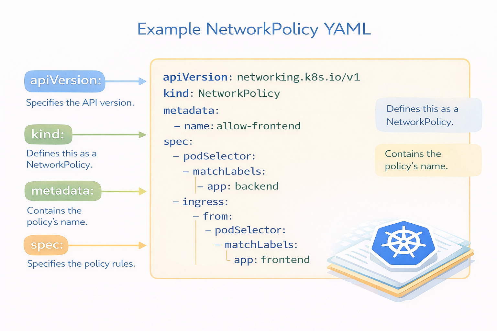

## Politicas de red (Network policies)

Las Network Policies son reglas de seguridad de red que controlan qué Pods pueden comunicarse entre sí y con otros recursos dentro del cluster.

En otras palabras: Network Policies = firewall para Pods.

Las Network Policies controlan dos tipos de tráfico:

- Ingress:	tráfico que entra al Pod
- Egress:	tráfico que sale del Pod

<p align="center">

</p>


Por ejemplo:

```
apiVersion: networking.k8s.io/v1
kind: NetworkPolicy
metadata:
  name: allow-frontend
spec:
  podSelector:
    matchLabels:
      app: backend
  policyTypes:
  - Ingress
  ingress:
  - from:
    - podSelector:
        matchLabels:
          app: frontend
```

Qué hace esta política

- Se aplica a Pods con app=backend
- Solo permite tráfico desde Pods con app=frontend
- Todo lo demás queda bloqueado
